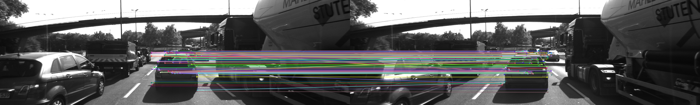
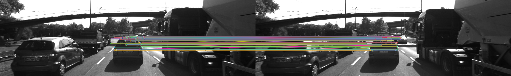
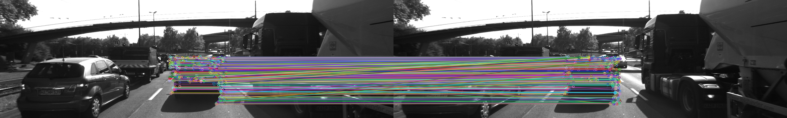
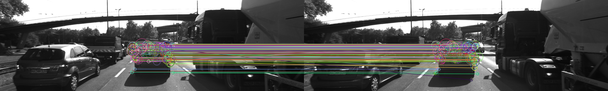
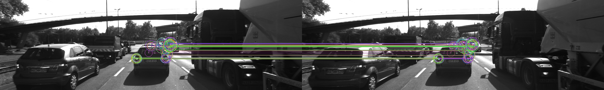
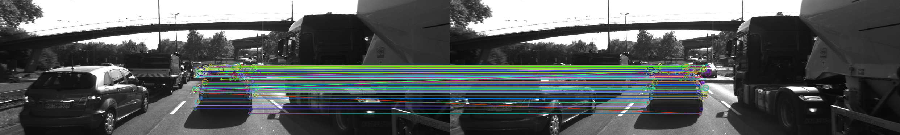
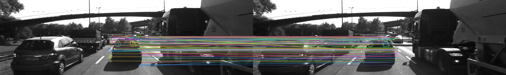

# Camera Based 2D Feature Tracking

## 1- Data Buffer Optimization: Implement a vector for dataBuffer objects whose size does not exceed a limit (e.g. 2 elements). This can be achieved by pushing in new elements on one end and removing elements on the other end.

MidTermProject_Camera_student.cpp
```C++
if(dataBuffer.size() < dataBufferSize)
{
    dataBuffer.push_back(frame);
}
else
{
    dataBuffer.erase(dataBuffer.begin());
    dataBuffer.push_back(frame);
}
```

## 2- Keypoint Detection: Implement detectors HARRIS, FAST, BRISK, ORB, AKAZE, and SIFT and make them selectable by setting a string accordingly.

MidTermProject_Camera_Student.cpp
```C++
vector<cv::KeyPoint> keypoints; // create empty feature list for current image

//// STUDENT ASSIGNMENT
//// TASK MP.2 -> add the following keypoint detectors in file matching2D.cpp and enable string-based selection based on detectorType
//// -> HARRIS, FAST, BRISK, ORB, AKAZE, SIFT
double time = 0;
if (detectorType.compare("SHITOMASI") == 0)
{
    time = detKeypointsShiTomasi(keypoints, imgGray, false);
}
else if(detectorType.compare("HARRIS") == 0)
{
    time = detKeypointsHarris(keypoints, imgGray, false);
}
else 
{
    time = detKeypointsModern(keypoints, imgGray, detectorType, false);
}
```
Implementing the HARRIS detector in "matching2D_student.cpp"
```C++
double detKeypointsHarris(std::vector<cv::KeyPoint> &keypoints, cv::Mat &img, bool bVis)
{
    int neighborhoodSize = 4;
    int sobelKernel = 3;
    double freeParam = 0.05;
    double t = (double)cv::getTickCount();
    Mat HaarisRslt = Mat::zeros(img.size(), CV_32FC1);
    cornerHarris(img,HaarisRslt,neighborhoodSize, sobelKernel, freeParam);
    Mat dst_norm,dst_norm_scaled;
    normalize( HaarisRslt, dst_norm, 0, 255, NORM_MINMAX, CV_32FC1, Mat() );
    convertScaleAbs( dst_norm, dst_norm_scaled );
    uint thresh = 70;
    for(int row = 0; row < dst_norm.rows; row++)
    {
        for(int col = 0; col < dst_norm.cols; col++)
        {
            if((int)dst_norm.at<float>(row, col) > thresh)
            {
                circle( dst_norm_scaled, Point( col, row ), 10,  Scalar(0), 2, 8, 0 );
                KeyPoint newKp;
                newKp.pt = Point2f(col, row);
                newKp.size=neighborhoodSize;
                keypoints.push_back(newKp);
            }
        }
    }
    cout<<"Count detected KP = "<<keypoints.size()<<endl;
    t = ((double)cv::getTickCount() - t) / cv::getTickFrequency();
    cout << "HAARIS Corner detection with n=" << keypoints.size() << " keypoints in " << 1000 * t / 1.0 << " ms" << endl;
    return t;
}
```
 Implementing the modern detectors in "matching2D_Student.cpp"
```C++
double detKeypointsModern(std::vector<cv::KeyPoint> &keypoints, cv::Mat &img, std::string detectorType, bool bVis)
{
    Ptr<cv::DescriptorExtractor> detector;
    if(detectorType.compare("FAST") == 0)
    {
        detector = FastFeatureDetector::create();
    }
    else if(detectorType.compare("BRISK") == 0)
    {
        detector = BRISK::create();
    }
    else if(detectorType.compare("ORB") == 0)
    {
        detector = ORB::create();
    }
    else if(detectorType.compare("AKAZE") == 0)
    {
        detector = cv::AKAZE::create();
    }
    else if(detectorType.compare("SIFT") == 0)
    {
        detector = cv::xfeatures2d::SIFT::create();
    }
    if(detector)
    {
        double t = (double)cv::getTickCount();
        detector->detect(img, keypoints);
        t = ((double)cv::getTickCount() - t) / cv::getTickFrequency();
        cout << detectorType <<" detection with n=" << keypoints.size() << " keypoints in " << 1000 * t / 1.0 << " ms" << endl;
        return t;
    }
    else
    {
        cout<<"Could not define the detector type!!"<<endl;
        return 0;
    }
}
```
## 3- Keypoint Removal: Remove all keypoints outside of a pre-defined rectangle and only use the keypoints within the rectangle for further processing.
I check if the keypoint position located inside the rectangle, based on the x, y position of the point.
```C++
cv::Rect vehicleRect(535, 180, 180, 150);
if (bFocusOnVehicle)
{
    for(auto itr = keypoints.end() - 1; itr >= keypoints.begin(); itr--)
    {
        if(((*itr).pt.x<vehicleRect.x || (*itr).pt.x>(vehicleRect.x + vehicleRect.width))
            || ((*itr).pt.y<vehicleRect.y || (*itr).pt.y>(vehicleRect.y + vehicleRect.height)))
            {
                keypoints.erase(itr);
            }
    }
}
```
## 4- Keypoint Descriptors: Implement descriptors BRIEF, ORB, FREAK, AKAZE and SIFT and make them selectable by setting a string accordingly.
MidTermProject_Camera_Student.cpp
```C++
cv::Mat descriptors;
time += descKeypoints((dataBuffer.end() - 1)->keypoints, (dataBuffer.end() - 1)->cameraImg, descriptors, descriptorType);
```
The implementation in matching2D_Student.cpp
```C++
double descKeypoints(vector<cv::KeyPoint> &keypoints, cv::Mat &img, cv::Mat &descriptors, string descriptorType)
{
    // select appropriate descriptor
    cv::Ptr<cv::DescriptorExtractor> extractor;
    if (descriptorType.compare("BRISK") == 0)
    {
        int threshold = 30;        // FAST/AGAST detection threshold score.
        int octaves = 3;           // detection octaves (use 0 to do single scale)
        float patternScale = 1.0f; // apply this scale to the pattern used for sampling the neighbourhood of a keypoint.

        extractor = cv::BRISK::create(threshold, octaves, patternScale);
    }
    else if(descriptorType.compare("BRIEF") == 0)
    {
        extractor = cv::xfeatures2d::BriefDescriptorExtractor::create();
    }
    else if(descriptorType.compare("ORB") == 0)
    {
        extractor = cv::ORB::create();
    }
    else if(descriptorType.compare("FREAK") == 0)
    {
        extractor = cv::xfeatures2d::FREAK::create();
    }
    else if(descriptorType.compare("AKAZE") == 0)
    {
         Ptr<cv::AKAZE> aExtractor = cv::AKAZE::create();
        double tt = (double)cv::getTickCount();
    aExtractor->compute(img, keypoints, descriptors);
    tt = ((double)cv::getTickCount() - tt) / cv::getTickFrequency();
    cout << descriptorType << " descriptor extraction in " << 1000 * tt / 1.0 << " ms" << endl;
    }
    else if(descriptorType.compare("SIFT") == 0)
    {
        extractor = cv::xfeatures2d::SIFT::create();
    }
    else
    {
        return 0;
    }
    // perform feature description
    double t = (double)cv::getTickCount();
    extractor->compute(img, keypoints, descriptors);
    t = ((double)cv::getTickCount() - t) / cv::getTickFrequency();
    cout << descriptorType << " descriptor extraction in " << 1000 * t / 1.0 << " ms" << endl;
    return t;
}
```

## 5- Descriptor Matching: Implement FLANN matching as well as k-nearest neighbor selection. Both methods must be selectable using the respective strings in the main function.
Implementing (FLANN) matching in "matching2D_Student.cpp"
```C++
if (matcherType.compare("MAT_BF") == 0)
{
    int normType = cv::NORM_HAMMING;
    matcher = cv::BFMatcher::create(normType, crossCheck);
}
else if (matcherType.compare("MAT_FLANN") == 0)
{
    matcher = cv::DescriptorMatcher::create(cv::DescriptorMatcher::FLANNBASED);
}
```
Implementing (k-nearest neighbor selection) in "matching2D_Student.cpp"
```C++
// perform matching task
if (selectorType.compare("SEL_NN") == 0)
{ // nearest neighbor (best match)

    matcher->match(descSource, descRef, matches); // Finds the best match for each descriptor in desc1
}
else if (selectorType.compare("SEL_KNN") == 0)
{ // k nearest neighbors (k=2)
    vector<vector<DMatch>> knnMatches;
    matcher->knnMatch(descSource,descRef, knnMatches, 2);
    float thresh_ratio = 0.8;
    for(size_t i = 0; i < knnMatches.size(); i++)
    {
        if(knnMatches[i][0].distance < thresh_ratio * knnMatches[i][1].distance)
        {
            matches.push_back(knnMatches[i][0]);
        }
    }
}
```
## 6- Descriptor Distance Ratio: Use the K-Nearest-Neighbor matching to implement the descriptor distance ratio test, which looks at the ratio of best vs. second-best match to decide whether to keep an associated pair of keypoints.
In the code above I used the variable "thresh_ratio", which describe the distance ratio.

## 7- Performance Evaluation 1: Count the number of keypoints on the preceding vehicle for all 10 images and take note of the distribution of their neighborhood size. Do this for all the detectors you have implemented.
All result images could be found in "Results/Images". Anyway, below is an illustration of the results.
| Detector |      Preview     | Keypoints   |
| -------- |:----------------:|------------:|
|SHITOMASI |  | 112 - 127   |
|HARRIS    |  | 479 - 26741 |
|FAST      |  | 389 - 431   |
|BRISK     |  | 250 - 293   |
|ORB       |  | 91 - 129    |
|AKAZE     |  | 154 - 157   |
|SIFT      |  | 121 - 156   |
## 8- Performance Evaluation 2: Count the number of matched keypoints for all 10 images using all possible combinations of detectors and descriptors. In the matching step, the BF approach is used with the descriptor distance ratio set to 0.8.
I used text writer function in "MidTermProject_Camera_Student.cpp" to register all the counted of the matched points in every image.
```C++
void AddPerformanceTxt2(vector<cv::DMatch> kps, int imgNum)
{
    _performanceTxt_2 += ("Image " + std::to_string(imgNum + 1) + ":\n");
    _performanceTxt_2 += ("Number of Matches = " + std::to_string(kps.size()) + "\n");
}
```
This above function is called from inside the for-loop in main function as following:
```C++
matchDescriptors((dataBuffer.end() - 2)->keypoints, (dataBuffer.end() - 1)->keypoints,
                             (dataBuffer.end() - 2)->descriptors, (dataBuffer.end() - 1)->descriptors,
                             matches, matchDescriptorType, matcherType, selectorType);

//// EOF STUDENT ASSIGNMENT

// store matches in current data frame
(dataBuffer.end() - 1)->kptMatches = matches;

cout << "#4 : MATCH KEYPOINT DESCRIPTORS done" << endl;

AddPerformanceTxt2(matches, imgIndex);
```

## 9- Performance Evaluation 3: Log the time it takes for keypoint detection and descriptor extraction. The results must be entered into a spreadsheet and based on this data, the TOP3 detector / descriptor combinations must be recommended as the best choice for our purpose of detecting keypoints on vehicles.
The best three detector/descriptor combinations I found out from the out results are as the following:

| Detector-Descriptor | Average Number Of Keypoints | Average Elapsed Time [ms] |
|:-------------------:|:---------------------------:|:-------------------------:|
|  FAST - BRIEF       | 414                         | 11.88                     |
|  FAST - BRISK       | 414                         | 15.91                     |
|  FAST - ORB         | 414                         | 19,54                     |